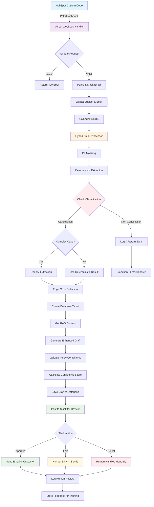
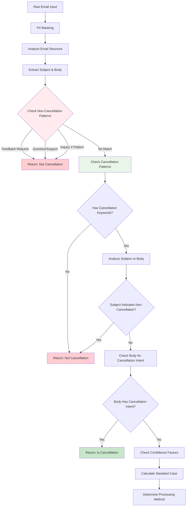
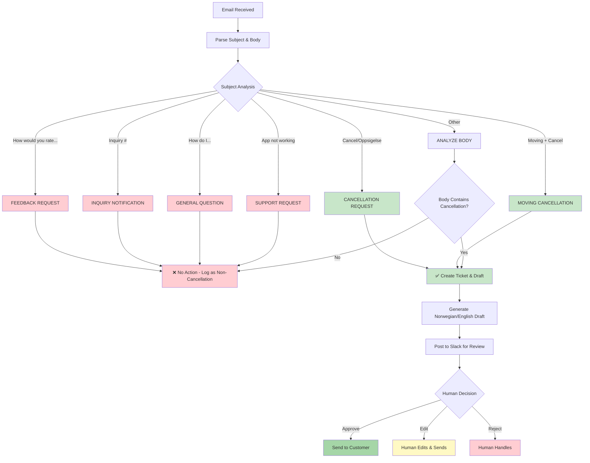
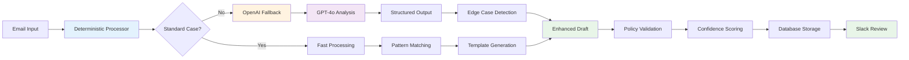
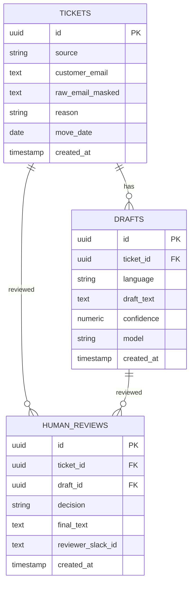
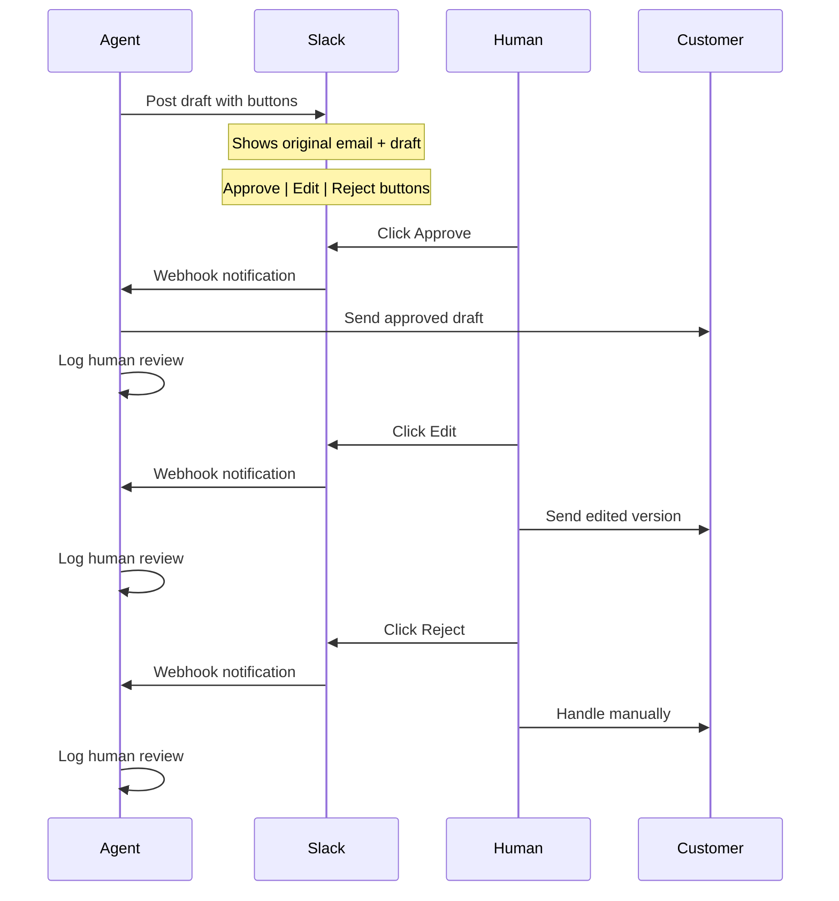
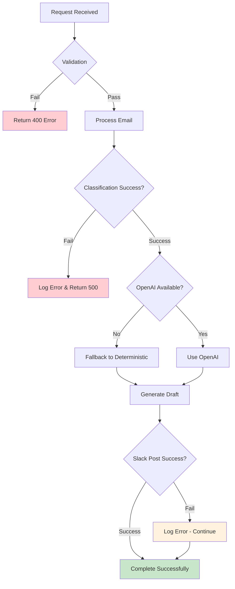

# Elaway Email Agent Process Flow

## Complete Agent Process from HubSpot Webhook to Customer Reply

## Detailed Classification Process

## Email Processing Decision Tree

## Hybrid Processing Architecture

## Database Schema & Data Flow

## Slack Review Workflow

## Key Components & Technologies

### Frontend (HubSpot)
- **Custom Code Action**: Triggers webhook with ticket data
- **Properties**: subject, description, ID, email, threadID

### Backend (Vercel)
- **Webhook Handler**: `/api/webhook` - Receives and validates requests
- **Hybrid Processor**: Deterministic + OpenAI fallback
- **Database**: Neon PostgreSQL with Drizzle ORM
- **Slack Integration**: Posts drafts for human review

### AI/ML Components
- **Pattern Matching**: Regex-based deterministic classification
- **OpenAI GPT-4o**: Complex case analysis with structured outputs
- **RAG Context**: Vector store for enhanced responses
- **Confidence Scoring**: Multi-factor confidence calculation

### Human-in-the-Loop
- **Slack Review**: Interactive buttons for approve/edit/reject
- **Feedback Loop**: Stores approved pairs for fine-tuning
- **Metrics**: Tracks accuracy and performance

## Error Handling & Monitoring

This comprehensive flow shows how the Elaway email agent processes customer emails from initial receipt through final response, with multiple validation layers and human oversight to ensure accuracy and prevent misclassification.
